<h1>Welcome to MINI ECOMMERCE Website</h1>
<h4>This is implemented by fully using php object oriented concept</h4>
<h4>There have <a href="#admin">Admin Panel</a> And <a href="#user">User Panel</a></h4>

There are Three classes:

<ol>
    <li>Category</li>
    <li>Brand</li>
    <li>Product</li>
</ol>

Admin role:

<ul>
    <li>CRUD operation of Category</li>
    <li>CRUD operation of Brand</li>
    <li>CRUD operation of Product</li>
</ul>

Users role:

<ul>
    <li>User can show all Product</li>
</ul>

<h5 id="user">User Panel</h5>

Home page

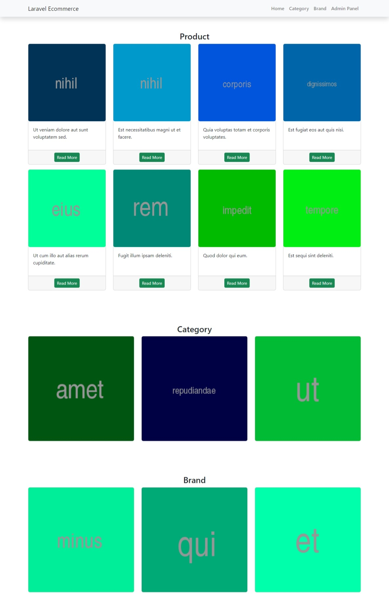

Product Detail

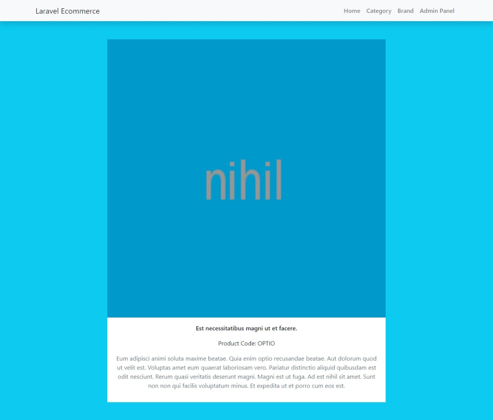

Product show Category wise

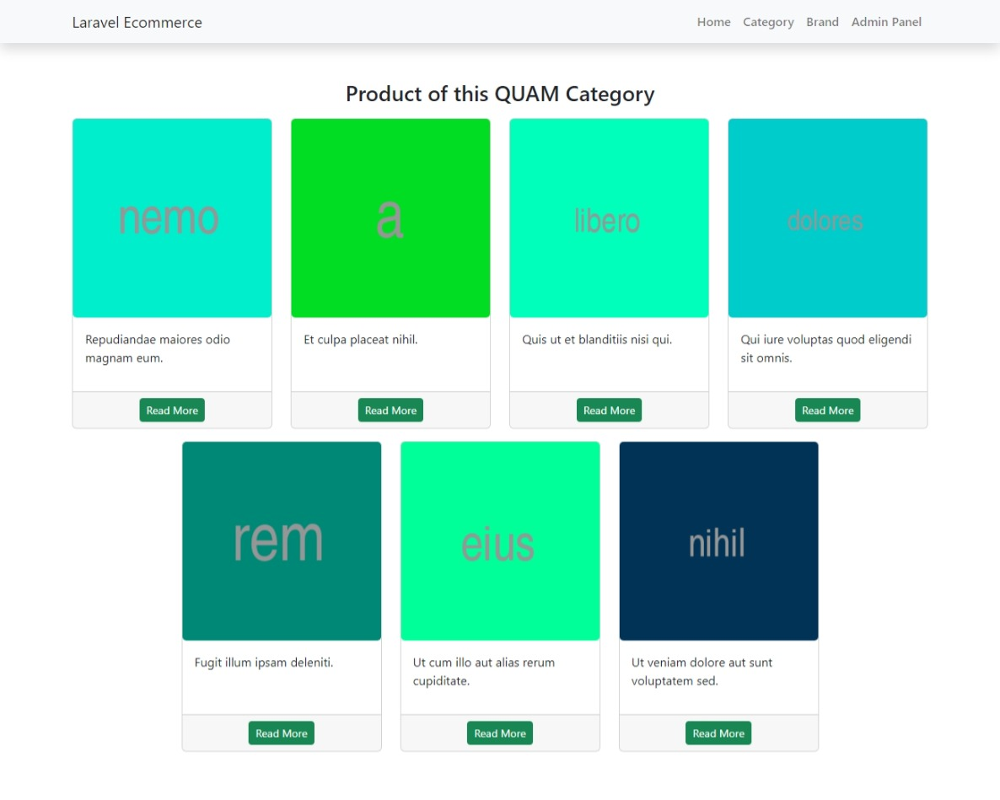

Product show Brand wise

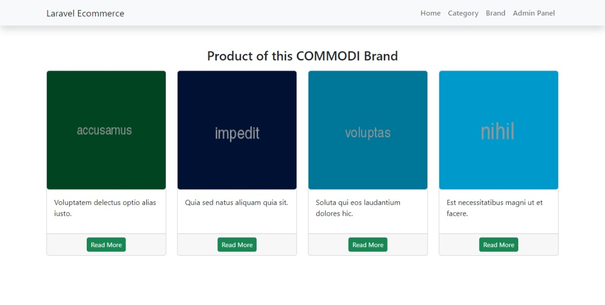

<h1 id="admin">Admin Panel</h1>

All Category

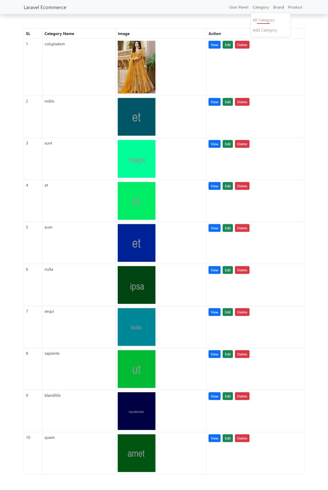

Add Category

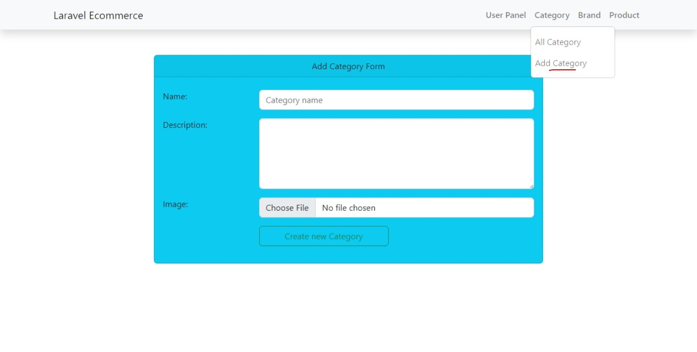

Edit Category

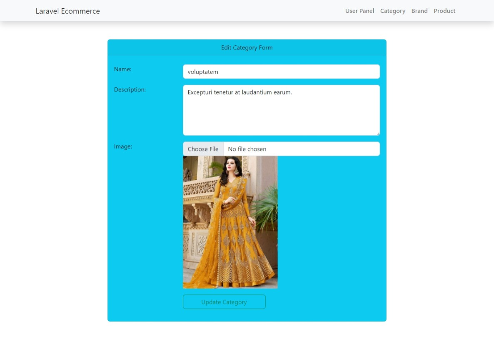

All Brand

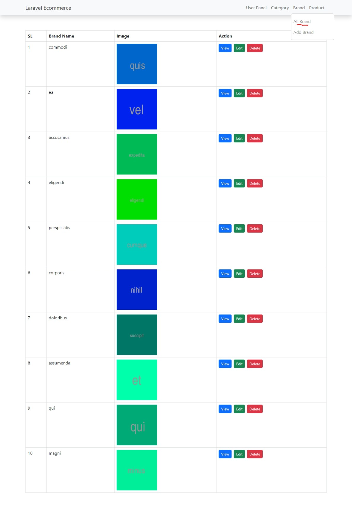

Add Brand

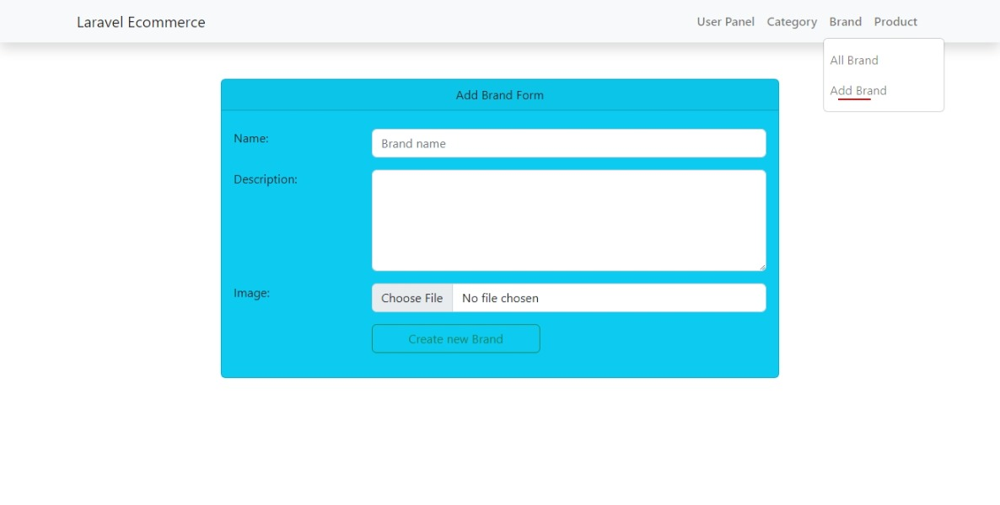

Edit Brand

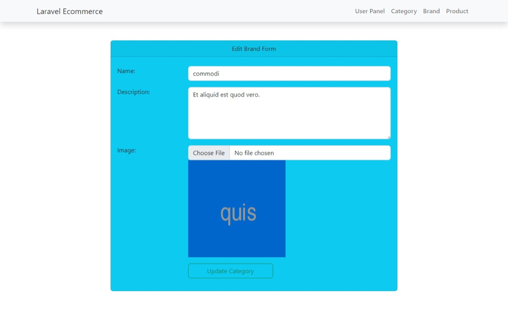

All Product

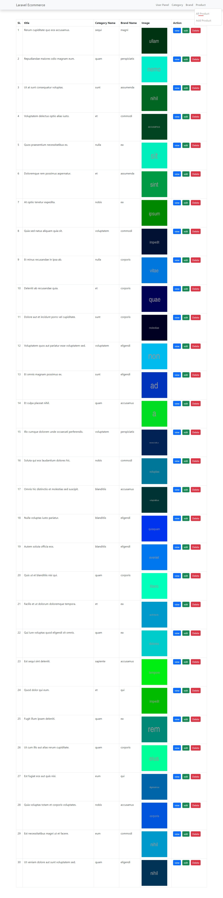

Show Product

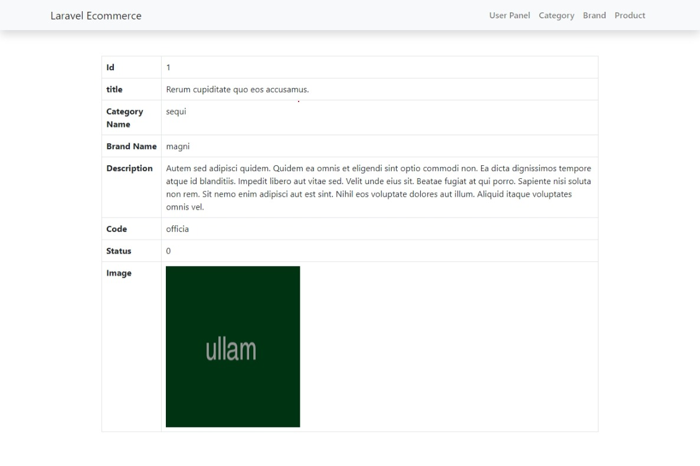

Add Product

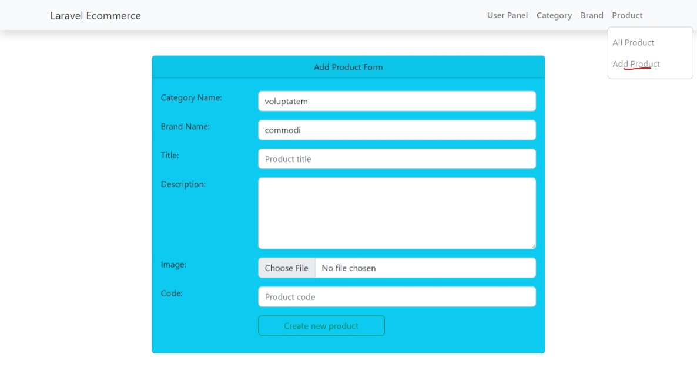

Edit Product

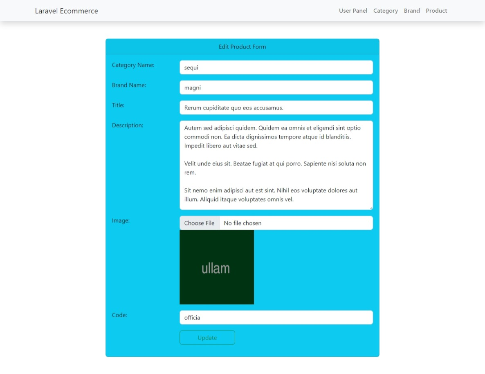

